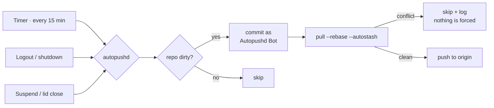

<div align="center">

# autopushd

**Your local commits, pushed before you ever get the chance to lose them.**

A tiny systemd daemon that auto-commits and pushes dirty git repos — on a timer, on logout, and right before your laptop suspends.

[](LICENSE)
[](bin/autopushd)
[](https://www.freedesktop.org/wiki/Software/systemd/)
[](#install)

</div>

---

### The problem

You work on a project on your desktop. You close the terminal, don't push, go to bed.
Next day at the studio, on your laptop — the repo is stale, and you can't continue where you left off.

`autopushd` makes **"did I push?"** a question you never have to ask again.

No file-watcher, no `inotify` babysitting every keystroke. Just three cheap, well-timed triggers that cover the moments people actually lose work.

## How it works



For every git repo (with an `origin` remote) under the directories you configure:

| Step | What happens |
|---|---|
| 1. Commit | If dirty: `git add -A && git commit`, authored as **`Autopushd Bot <autopushd@local>`** — bot commits never blend into your real history |
| 2. Sync | `git pull --rebase --autostash` against the tracked upstream — handles local/remote branch name mismatches correctly |
| 3. Push | If ahead of upstream: push |
| 4. Self-heal | Rewrites `https://github.com/...` origins to `git@github.com:...` — the usual silent reason a "sync" script goes quiet with no credential helper |

Everything lands in `~/.config/autopushd/autopushd.log`. **Nothing is force-pushed. Nothing is force-merged.** A real conflict during rebase is skipped and logged, never auto-resolved.

## Triggers

| Trigger | Mechanism | Covers |
|---|---|---|
| Every 15 min | `systemd --user` timer | forgetting entirely |
| Logout / shutdown | `ExecStop` on a user service | graceful shutdown |
| Suspend / lid close | `/usr/lib/systemd/system-sleep/` hook | the case that actually loses work |

The suspend hook runs as root (a systemd requirement) but re-enters your user's `systemd --user` environment to pick up your real `SSH_AUTH_SOCK` — it authenticates exactly as you would.

## Install

```bash
git clone git@github.com:horiastanxd/autopushd.git
cd autopushd
./install.sh
```

Then edit `~/.config/autopushd/roots.txt` with the parent directories you want scanned recursively:

```
~/Projects
~/work
```

The installer offers the suspend hook as an opt-in step (one `sudo` prompt, drops a single file in `/usr/lib/systemd/system-sleep/`).

**Requires:** Linux with `systemd --user` sessions, `git`, `flock`. No dependencies beyond coreutils.

## Uninstall

```bash
./uninstall.sh
```

## vs. gitwatch

[gitwatch](https://github.com/gitwatch/gitwatch) is the established tool in this space, but a different shape: it watches one folder via `inotify`/`fswatch` and commits on *every* file change — great for a notes vault, noisy for a normal dev repo.

`autopushd` runs on a handful of meaningful triggers across *every* repo you point it at, and treats bot commits as first-class — a distinct author, not diluted into your real history.

## FAQ

<details>
<summary><strong>Will it fight with commits I'm actively writing?</strong></summary><br>

No — it only commits what's on disk at trigger time (timer tick, logout, suspend). It never runs mid-keystroke.
</details>

<details>
<summary><strong>What if two machines edited the same file?</strong></summary><br>

`pull --rebase` will hit a real conflict. That repo is skipped and logged — resolve it manually, same as any rebase conflict. autopushd never guesses.
</details>

<details>
<summary><strong>Can I filter bot commits out of my history?</strong></summary><br>

```bash
git log --invert-grep --author="Autopushd Bot"   # just your commits
git log --author="Autopushd Bot"                  # just the bot's
```
</details>

## Safety

- Never force-pushes, never rewrites history.
- A real merge conflict is skipped and logged — never silently dropped or overwritten.
- A single `flock`-guarded lock file prevents overlapping runs.

## License

MIT
